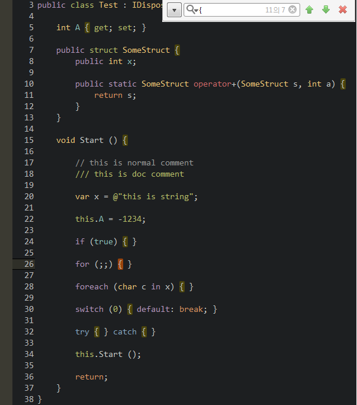

monodevelop-colors-tomorrow-theme
=================================

this is for monodevelop syntax color with [tomorrow-theme].


## Screenshoot
* TomorrowNight


## How to install
* in MonoDevelop `open menu -> Tools -> Options`
* navigate to -> `Text Editor -> Syntax Highlighing`
* press `Add` button
* navigate to file `TomorowNight.json`
* press `Open`
* select `TomorrowNight` theme and then press `OK`
* close and reopen all your file tabs


## TomorrowNight

```ruby
tomorrow_night = {
  :name         => 'TomorrowNight',
  :color_background   => '#1d1f21',
  :color_current_line => '#282a2e',
  :color_selection    => '#373b41',
  :color_foreground   => '#c5c8c6',
  :color_comment      => '#969896',
  :color_red          => '#cc6666',
  :color_orange       => '#de935f',
  :color_yellow       => '#f0c674',
  :color_green        => '#b5bd68',
  :color_aqua         => '#8abeb7',
  :color_blue         => '#81a2be',
  :color_purple       => '#b294bb'
}
```


 [tomorrow-theme]: https://github.com/chriskempson/tomorrow-theme
