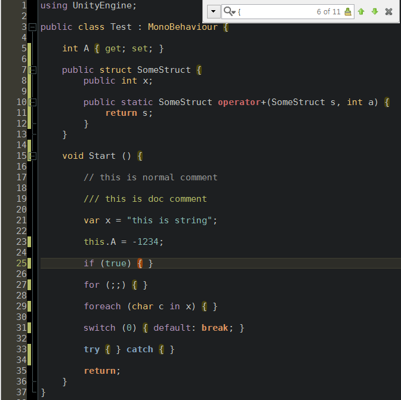

monodevelop-colors-tomorrow-theme
=================================

this is for monodevelop syntax color with [tomorrow-theme].

based on [MonokaiStyle] theme.

## Screenshoot
* TomorrowNight


## How to install
* in MonoDevelop `open menu -> Tools -> Options`
* navigate to -> `Text Editor -> Syntax Highlighing`
* press `Add` button
* nvigate to file `TomorowNight.xml`
* press `Open`
* select `TomorrowNight` theme and then press `OK`
* close and reopen all your file tabs


## TomorrowNight

```xml
  <!-- Color -->
  <Color value="#1d1f21" name="color_background" />
  <Color value="#282a2e" name="color_current_line" />
  <Color value="#373b41" name="color_selection" />
  <Color value="#c5c8c6" name="color_foreground" />
  <Color value="#969896" name="color_comment" />
  <Color value="#cc6666" name="color_red" />
  <Color value="#de935f" name="color_orange" />
  <Color value="#f0c674" name="color_yellow" />
  <Color value="#b5bd68" name="color_green" />
  <Color value="#8abeb7" name="color_aqua" />
  <Color value="#81a2be" name="color_blue" />
  <Color value="#b294bb" name="color_purple" />
```


 [MonokaiStyle]: https://github.com/dkucinskas/MonoDevelop-Styles
 [tomorrow-theme]: https://github.com/chriskempson/tomorrow-theme
